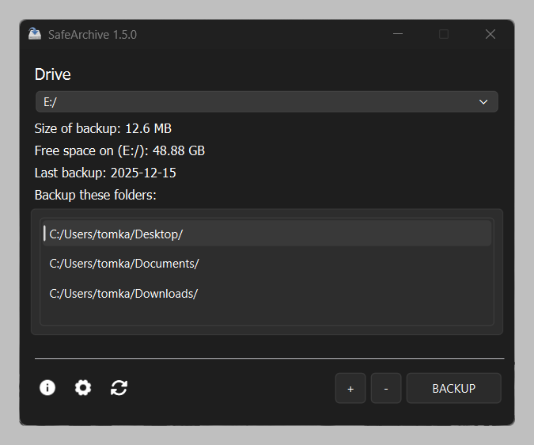
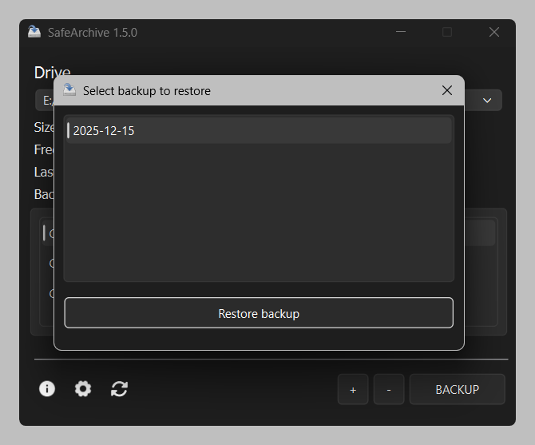
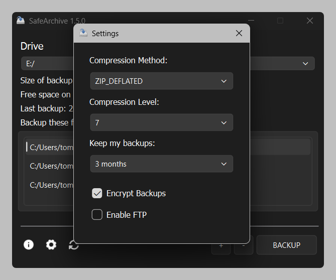

<div align="center">
  
  <p><strong>SafeArchive:</strong> Securely backup and manage your files locally with NAS support.</p>
  <a href="https://github.com/KafetzisThomas/SafeArchive/releases">
    
  </a>
</div>

## Features

- [X] Backup to **local drives** or via `SFTP` (using **SSH**, **NAS friendly**)
- [X] Supported compression: `DEFLATED`, `STORED`, `LZMA`, `BZIP2` (Levels **1-9**) and `ZIP64` (**>4GB**)
- [X] Backup **encryption** and built-in **restoration**
- [X] Automated backup expiry management
- [X] Multi-threaded process
- [X] Command line interface support
- [ ] Automatic backups in the background (beta)

**Supported platforms:** `Windows`, `Linux`, `macOS`

## Usage

```bash
git clone https://github.com/KafetzisThomas/SafeArchive.git
cd path/to/root/directory && pip install uv

# Run GUI
uv run main.py

# Run CLI
uv run main.py --nogui
```

## Packaging

You can create a standalone executable using pyinstaller:

```bash
pyinstaller main.spec
```

## Setup for SFTP Server

1. Enable the `SFTP` switch within the application settings or set the `"sftp"` value to `true` in `settings.json`.

2. Configure your credentials (**hostname**, **username**, **password**) directly in `settings.json`.

## Demo Images







## Contributing Guidelines

### Pull Requests

- **Simplicity**: Keep changes focused and easy to review.
- **Libraries**: Avoid adding non-standard libraries unless discussed via an issue.
- **Testing**: Ensure code runs error-free, passes all tests, and meets coding standards.

### Bug Reports

- Report bugs via GitHub Issues.
- Submit pull requests via GitHub Pull Requests.

## Thanks to all contributors

<a href="https://github.com/KafetzisThomas/SafeArchive/graphs/contributors">
  
</a>

Made with [contrib.rocks](https://contrib.rocks).

Thank you for supporting SafeArchive!
